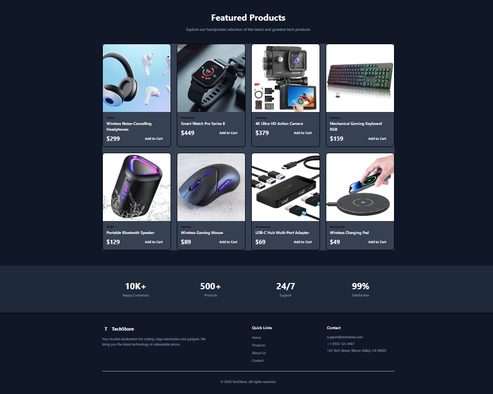

# TechStore - Static E-commerce Homepage

A modern, responsive e-commerce website built with React, Vite, and Tailwind CSS. This project demonstrates fundamental React concepts including components, props, routing, and event handling.

## 🚀 Features

- **Four Main Pages**: Home, Products, About, and Contact
- **Responsive Design**: Fully responsive across desktop, tablet, and mobile devices
- **Reusable Components**: Modular component architecture with Navbar, Footer, ProductCard, and HeroSection
- **Dynamic Product Display**: 8 featured products on homepage, 12+ products on products page
- **Category Filtering**: Filter products by category (Audio, Gaming, Wearables, Cameras, Accessories)
- **Event Handling**: Interactive "Add to Cart" buttons with console logging and alerts
- **React Router**: Client-side routing for seamless navigation
- **Modern UI**: Dark theme with gradient accents and smooth transitions

## 📄 Pages

1. **Home Page**
   - Hero section with call-to-action buttons
   - 8 featured product cards
   - Statistics section
   - "Shop Now" button linking to Products page

2. **Products Page**
   - 12 products displayed in a grid
   - Category filter buttons
   - Each product has "Add to Cart" functionality

3. **About Page**
   - Company story and mission
   - "Why Choose Us" section with 4 key features
   - Professional layout with engaging content

4. **Contact Page**
   - Contact information (email, phone, address)
   - Business hours
   - Feedback form with name, email, and message fields
   - Form submission with console logging

## 🛠️ Technologies Used

- **React 18.3.1** - UI library
- **Vite 5.1.0** - Build tool and dev server
- **React Router DOM 6.22.0** - Client-side routing
- **Tailwind CSS 3.4.1** - Utility-first CSS framework

## 📦 Installation & Setup

### Prerequisites
- Node.js (v16 or higher)
- npm or yarn

### Steps to Run Locally

1. **Clone the repository**
   \`\`\`bash
   git clone <your-repo-url>
   cd techstore-ecommerce
   \`\`\`

2. **Install dependencies**
   \`\`\`bash
   npm install
   \`\`\`

3. **Start the development server**
   \`\`\`bash
   npm run dev
   \`\`\`

4. **Open your browser**
   Navigate to `http://localhost:5173`

### Build for Production

\`\`\`bash
npm run build
\`\`\`

The built files will be in the `dist` folder.

### Preview Production Build

\`\`\`bash
npm run preview
\`\`\`

## 📁 Project Structure

\`\`\`
techstore-ecommerce/
├── public/
├── src/
│   ├── components/
│   │   ├── Navbar.jsx          # Navigation bar component
│   │   ├── Footer.jsx          # Footer component
│   │   ├── ProductCard.jsx     # Reusable product card (uses props)
│   │   └── HeroSection.jsx     # Hero banner component
│   ├── pages/
│   │   ├── Home.jsx            # Homepage with featured products
│   │   ├── Products.jsx        # Products page with filtering
│   │   ├── About.jsx           # About page
│   │   └── Contact.jsx         # Contact page with form
│   ├── App.jsx                 # Main app component with routing
│   ├── main.jsx                # Entry point
│   └── index.css               # Global styles
├── index.html
├── package.json
├── vite.config.js
├── tailwind.config.js
└── README.md
\`\`\`

## 🎨 Component Architecture

### Reusable Components

1. **Navbar** - Responsive navigation with mobile menu
2. **Footer** - Site-wide footer with links and contact info
3. **ProductCard** - Displays product information via props:
   - `image` - Product image URL
   - `name` - Product name
   - `price` - Product price
   - `category` - Product category
   - `onAddToCart` - Callback function for cart actions
4. **HeroSection** - Landing page hero with CTAs

### Props Usage

The `ProductCard` component demonstrates props by receiving product data from parent components:

\`\`\`jsx
<ProductCard
  image="/path/to/image.jpg"
  name="Product Name"
  price={299}
  category="Electronics"
  onAddToCart={handleAddToCart}
/>
\`\`\`

### Event Handling

- **Add to Cart**: Clicking the "Add to Cart" button logs the product name to console and shows an alert
- **Form Submission**: Contact form logs input values to console on submit
- **Navigation**: "Shop Now" button navigates to Products page using React Router

## 🌐 Deployment

This project can be deployed to:
- **Vercel**: `npm run build` then deploy the `dist` folder
- **Netlify**: Connect your GitHub repo for automatic deployments
- **GitHub Pages**: Use `gh-pages` package for deployment

**Live Demo**: [Add your deployment link here]

## 📸 Screenshots

![Homepage]

*Modern homepage with hero section and featured products*

## 🎯 Learning Outcomes

This project demonstrates:
- ✅ React component structure and organization
- ✅ Props for passing data between components
- ✅ React Router for multi-page navigation
- ✅ Event handling for user interactions
- ✅ Responsive design with Tailwind CSS
- ✅ Modern JavaScript (ES6+) features
- ✅ Git version control with meaningful commits

## 👨‍💻 Author

MUTETERI REBECCA

